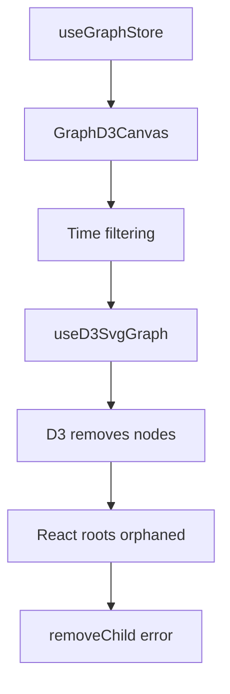

# Current Architecture Analysis: React-D3 Integration

## Component Hierarchy

```
GraphD3Canvas
├── GraphD3Toolbar
├── GraphD3SvgLayer
│   └── GraphD3SvgFrame
│       ├── GraphD3EdgeLayer (D3-managed)
│       └── GraphD3NodeLayer (React component)
│           └── GraphD3NodeMount (rendered via createRoot in D3 foreignObject)
├── TimeRangeSlider
├── EdgeContextMenu
└── GraphTooltipManager
```

## D3-React Integration Points

### 1. Direct createRoot Usage
**Files:**
- `src/hooks/useD3SvgGraph.tsx` (lines 305-341)
- `src/components/GraphD3NodeLayer.tsx` (lines 45-76)

**Problem:** React roots are created inside D3-managed foreignObject elements

### 2. Mixed DOM Manipulation
**Files:**
- `src/hooks/useD3SvgGraph.tsx` - D3 creates/removes SVG elements containing React roots
- `src/components/GraphD3NodeMount.tsx` - React component rendered inside D3 foreignObject

**Problem:** When D3 removes nodes during filtering, React roots become orphaned

### 3. Event Handler Mixing
**Files:**
- `src/hooks/useD3SvgGraph.tsx` (lines 271-303) - D3 event handlers
- `src/components/GraphD3NodeMount.tsx` - React event handlers

**Problem:** Events bubble through both D3 and React layers

## Data Flow



## State Synchronization Issues

1. **Position State**
   - D3 manages positions during force simulation
   - React needs positions for rendering
   - Currently synchronized via refs and callbacks

2. **Selection State**
   - Managed in Zustand store
   - Applied via D3 attribute updates
   - React components also read selection state

3. **Visibility State**
   - Time range filtering removes D3 nodes
   - React components inside those nodes get orphaned

## Root Tracking Attempts

Multiple systems trying to solve the same problem:
1. Global `nodeRootsMap` in `useD3SvgGraph.tsx`
2. Module-level `nodeLayerRootsMap` in `GraphD3NodeLayer.tsx`
3. Cleanup attempts in effect returns

None fully solve the issue because D3 removes DOM nodes before React can clean up.

## Files Requiring Major Changes

### Core Integration Files
1. `src/hooks/useD3SvgGraph.tsx` - Remove React rendering
2. `src/components/GraphD3NodeLayer.tsx` - Convert to portal-based
3. `src/components/GraphD3NodeMount.tsx` - Update to work with portals
4. `src/components/GraphD3SvgLayer.tsx` - Add portal container

### Supporting Files
1. `src/components/GraphD3Canvas.tsx` - Add portal provider
2. `src/hooks/useD3Force.ts` - Ensure no DOM manipulation
3. `src/hooks/useD3DragNodes.ts` - Update event handling
4. `src/hooks/useD3ZoomAndPan.tsx` - Coordinate with React layer

## Migration Strategy

### Phase 1: Parallel Implementation
1. Create new portal-based components alongside existing ones
2. Add feature flag to toggle between implementations
3. Ensure feature parity before switching

### Phase 2: Incremental Migration
1. Start with node rendering (highest impact)
2. Move to edge labels and tooltips
3. Finally migrate event handling

### Phase 3: Cleanup
1. Remove old implementation
2. Delete root tracking code
3. Simplify event handling

## Risk Assessment

### High Risk
- Breaking existing functionality during migration
- Performance degradation from additional layers
- Complex event handling across layers

### Mitigation
- Comprehensive testing at each step
- Performance benchmarking
- Feature flags for rollback

## Success Metrics

1. **Error Elimination**: No removeChild errors
2. **Performance**: <10ms render time for 1000 nodes
3. **Maintainability**: Clear separation of concerns
4. **Feature Parity**: All existing features working

## Next Steps

1. Create `GraphPortalProvider` component
2. Implement basic portal rendering for one node
3. Test with time filtering to verify approach
4. Expand to all nodes if successful